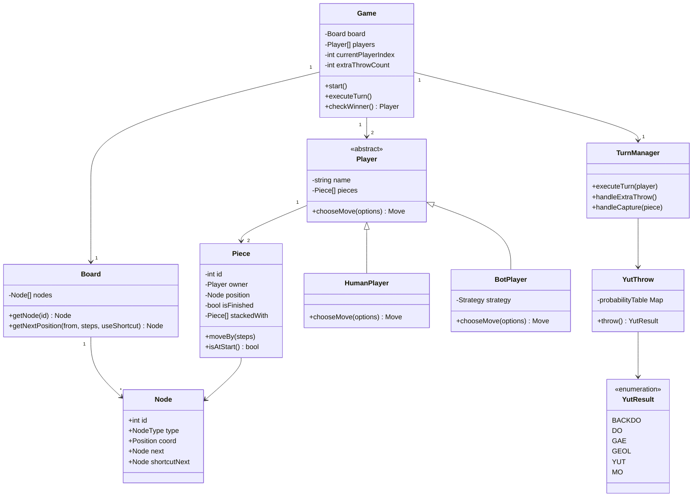
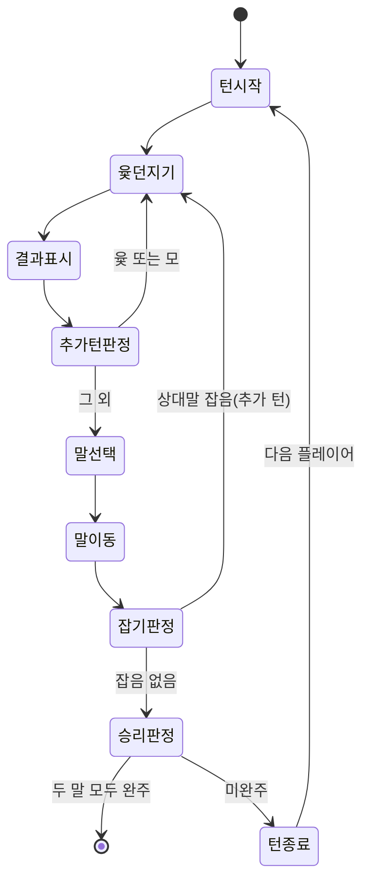
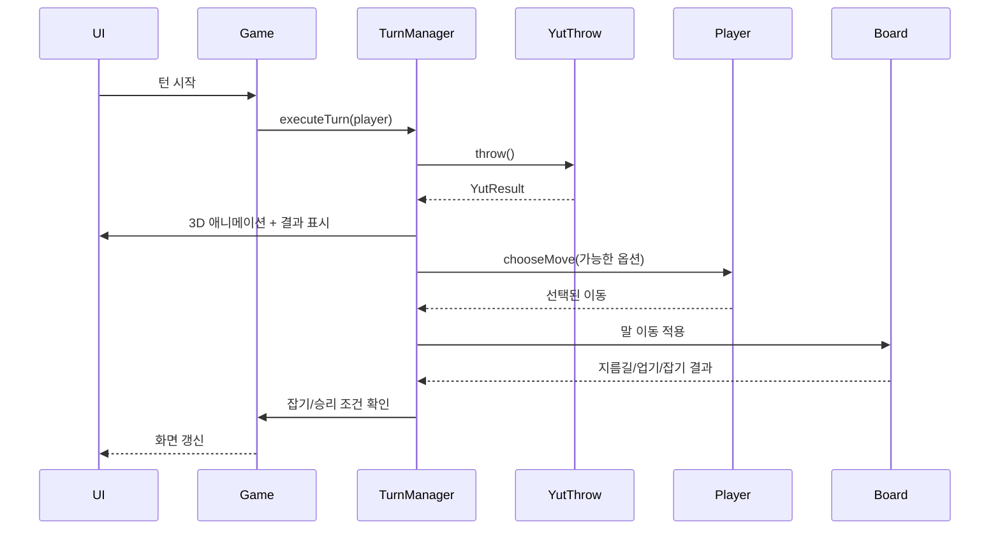

# 사이버 윷놀이 (Cyber Yutnori) PRD

## 0. 문서 정보

| 항목 | 내용 |
|---|---|
| 문서 유형 | PRD (Product Requirements Document) |
| 작성자 | seoulax24 (+ AI 에이전트 co-authoring) |
| 대상 독자 | 본인, 개발을 진행하는 AI 에이전트, 외부 멘토(코드리뷰어) |
| 산출물 | 각 개발 단계별 결과물을 Claude Artifact로 등록 (단일 HTML/JS 파일) |
| 상태 | Draft — 구현 진행하며 갱신 |

---

## 1. 개요

### 1.1 프로젝트 소개

AI 에이전트(Claude)와 함께 페어 프로그래밍 방식으로 전통 윷놀이를 웹 게임으로 구현한다. 2명의 참가자(사람 또는 봇)가 1:1로 턴을 주고받으며 전통 윷놀이 규칙에 따라 말을 움직여 먼저 두 말을 모두 완주시키는 쪽이 승리한다.

### 1.2 학습 목표

- 사이버 윷놀이 게임을 AI 에이전트와 함께 개발하는 경험을 쌓는다
- 턴 방식 1:1 게임의 상태 관리와 흐름 제어를 구현할 수 있다
- 윷놀이 말판 위에서의 말 이동(지름길, 업기, 잡기 포함) 로직을 구현할 수 있다

### 1.3 문서 목적 및 대상 독자

이 문서는 구현에 들어가기 전 기능/규칙/아키텍처에 대한 합의를 기록하고, 이후 여러 개발 세션(대화창)에 걸쳐 단계적으로 작업을 이어갈 때 각 세션이 참고할 단일 기준(source of truth) 역할을 한다. 외부 멘토가 설계 원리를 빠르게 파악할 수 있도록 UML 다이어그램(클래스/상태/시퀀스)을 포함한다.

---

## 2. 용어 정리

| 용어 | 설명 |
|---|---|
| 도/개/걸/윷/모 | 윷 던지기 결과. 각각 1/2/3/4/5칸 전진 |
| 빽도 | 윷 던지기 결과 중 하나. 1칸 후퇴 (시작점 이전이면 즉시 아웃 처리) |
| 업기 | 같은 편의 말 2개가 같은 칸에 있을 때 하나의 묶음으로 합쳐져 함께 이동하는 것 |
| 잡기 | 상대 말이 있는 칸에 도착해 상대 말을 시작 전(말판 밖)으로 되돌리는 것 |
| 지름길 | 말판 모서리(꼭짓점)에서 중앙을 거쳐 반대편으로 질러가는 대각선 경로 |
| 완주 | 말이 말판을 한 바퀴(또는 지름길 경유) 돌아 출발점을 통과해 빠져나가는 것 |
| 턴 | 한 플레이어가 윷을 던지고 말을 움직이는 한 차례의 행동 단위 (추가 턴 포함 가능) |

---

## 3. 기능 요구사항

1. 참가자 2명이 1:1로 턴 방식 진행 (사람/봇 조합은 시작 시 선택)
2. 전통 윷놀이 말판, 각 플레이어 말 2개
3. 턴마다 도/개/걸/윷/모 (+ 빽도) 결과를 표시
4. 말 2개는 업을 수 있으며, 2개 말이 모두 시작점으로 돌아와야 게임 종료
5. 말판/윷 디자인은 보기 좋은 수준에서 자유롭게 결정 (코믹한 톤, 3D 윷 던지기)
6. 그 외 동작은 전통 윷놀이 규칙을 따름 (잡기, 추가 턴 등)

---

## 4. 게임 규칙 상세 명세

### 4.1 말판 구조

전통 윷판을 그래프(노드 + 간선) 구조로 모델링한다.

- 외곽 경로: 20개 노드로 구성된 순환 경로 (출발점 포함)
- 4개의 꼭짓점 노드: 각 꼭짓점은 중앙을 경유하는 **지름길** 간선을 추가로 가짐
- 중앙 노드 1개: 두 대각선 지름길이 교차하는 지점
- 정확한 좌표/세부 노드 수(전통적으로 20~29개 사이로 표기가 다양함)는 1단계(말판 구현) 에서 참고 이미지를 기반으로 확정한다

**지름길 사용 규칙**: 말이 꼭짓점 노드에 정확히 도달하면, 다음 이동 시 일반 경로 대신 지름길(중앙 경유)을 선택할 수 있다. 중앙에서 출발점 방향 꼭짓점으로 가는 마지막 지름길은 가장 짧은 완주 경로를 제공한다.

### 4.2 윷 던지기 확률 (전통 확률 기반)

윷가락 4개, 각각 앞/뒤 50% 가정 시 이항분포를 사용한다.

| 결과 | 조건(앞면 개수) | 확률 | 이동 |
|---|---|---|---|
| 모 | 0개 (전부 뒷면) | 1/16 | +5칸, 추가 턴 |
| 도 | 1개 | 3/16 | +1칸 |
| 빽도 | 1개 (특수 케이스로 분리) | 1/16 | -1칸 |
| 개 | 2개 | 6/16 | +2칸 |
| 걸 | 3개 | 4/16 | +3칸 |
| 윷 | 4개 (전부 앞면) | 1/16 | +4칸, 추가 턴 |

> **설계 결정**: 빽도는 물리적으로 4개 중 1개만 다르게 표시된 특수 윷가락으로 구현하지 않고, "도" 확률(4/16) 중 1/16을 빽도로 분리 배정하는 방식으로 단순화한다. (부록 10.1 참고)

### 4.3 말 이동 규칙

- 말은 출발점에서 시작해 외곽 경로를 따라 반시계 방향(전통 기준)으로 이동한다
- 빽도로 인해 출발점보다 앞(아직 출발 전)으로 이동해야 하면 해당 말은 그대로 대기 상태 유지 (출발 전 상태에서는 빽도 무시)
- 이동 후 도착 칸에 따라 지름길 선택 여부를 플레이어(또는 봇)가 결정
- 말이 정확히 출발점을 통과하여 나가면 "완주" 처리, 더 이상 이동 대상에서 제외

### 4.4 업기 (자동 병합)

- 같은 플레이어의 말 2개가 같은 칸에 도착하면 **자동으로** 하나의 묶음(스택)으로 병합된다
- 병합된 말은 이후 하나의 유닛처럼 함께 이동하며, 윷 던지기 결과만큼 함께 전진/후퇴한다
- 병합된 스택이 상대에게 잡히면 스택 내 말 전체가 동시에 출발 전 상태로 되돌아간다
- 병합된 스택이 완주하면 스택 내 말 전체가 동시에 완주 처리된다

### 4.5 잡기 & 추가 턴

- 이동한 말(또는 스택)이 도착한 칸에 상대 말(또는 스택)이 있으면 상대 말은 즉시 출발 전 상태로 되돌아간다 (잡기)
- 다음 두 조건 중 하나라도 만족하면 같은 플레이어가 윷을 한 번 더 던진다: (a) 윷 또는 모가 나옴 (b) 상대 말을 잡음
- 여러 조건이 동시에 만족되어도 추가 턴은 이벤트 발생 횟수만큼 누적된다 (예: 모가 나오고 동시에 잡기 성공 시 추가 턴 2회)
- 모든 추가 턴을 소진한 뒤에 상대에게 턴이 넘어간다

### 4.6 승리 조건

- 한 플레이어의 말 2개가 모두 완주(출발점을 통과해 빠져나감) 하면 즉시 게임 종료 및 승리 처리

---

## 5. 플레이어 구성 & 봇

### 5.1 시작 플로우

1. 게임 시작 시 "참가자 2명 중 사람은 몇 명인가요?" 질문 (0명 / 1명 / 2명 중 선택)
2. 선택에 따라 나머지는 봇으로 자동 배정
3. 0명(전원 봇) 선택 시: 사람 플레이어의 개입 없이 봇 2명이 자동으로 턴을 주고받는 관전 모드 화면이 표시됨

### 5.2 봇 AI 동작 방식

- 기본 전략: 가능한 이동 옵션(어떤 말을 움직일지, 지름길 사용 여부) 중 **랜덤 유효 선택** (추후 난이도별 전략 확장 가능하도록 인터페이스 분리)
- 봇의 턴에는 "생각 중" 표시(짧은 딜레이 + 시각적 하이라이트) 후 선택한 말/경로를 하이라이트로 보여준 뒤 이동 애니메이션 실행
- 전원 봇 모드에서도 동일한 시각화를 적용해 관전자가 봇의 의사결정을 따라갈 수 있게 한다

---

## 6. 시스템 아키텍처

### 6.1 기술 스택

- 단일 HTML 파일 (Claude Artifact로 게시, 단계별로 갱신)
- 렌더링: **말판 전체와 말(캐릭터), 윷 던지기 모두 three.js 기반 3D 장면** (5단계에서 2D SVG 말판을 3D로 교체 — 10.2 참고)
- 턴마다 카메라가 "전체 보기 → 현재 캐릭터 클로즈업 → 윷 던지기 확대 → 캐릭터 리액션 → 전체 보기"로 연출되는 시네마틱 흐름
- 효과음/배경음악은 외부 음원 파일 대신 Web Audio API로 직접 합성 (Artifact CSP상 임의 외부 오디오 파일을 불러올 수 없고, 라이선스 걱정 없이 완전 무료로 쓸 수 있기 때문 — 10.3 참고)
- 상태 관리: 순수 JS 객체/클래스 (프레임워크 없이 vanilla JS)
- 외부 라이브러리는 cdnjs.cloudflare.com에서 three.js UMD 빌드를 고정 버전으로 로드

### 6.2 클래스 다이어그램

### 6.3 상태 다이어그램 (턴 흐름)

### 6.4 시퀀스 다이어그램 (한 턴)

---

## 7. UI/UX 디자인 방향

### 7.1 전체 톤앤매너

트리컬(tricky)하고 코믹한 디자인. 진지한 전통 공예품 느낌보다는 장난스럽고 생동감 있는 색감/모션을 사용한다 (말에 표정을 넣거나, 결과에 따라 과장된 리액션 연출 등 자유롭게 판단).

### 7.2 3D 윷 던지기 (three.js)

- 별도의 3D 씬에서 윷가락 4개가 던져지고 회전하며 바닥에 떨어지는 애니메이션
- 애니메이션 종료 후 각 가락의 앞/뒤 상태를 판정해 결과(도/개/걸/윷/모/빽도) 산출 및 표시
- 코믹한 느낌을 위해 통통 튀는 과장된 물리감, 효과음/이펙트(선택) 고려

### 7.3 말판 UI

- 2D로 렌더링된 전통 윷판 위에 말(아이콘/이모지/커스텀 그래픽)을 배치
- 업힌 말은 시각적으로 겹치거나 묶음 표시(예: 뱃지에 숫자 "2")로 구분
- 현재 턴 플레이어, 남은 추가 턴 수를 항상 화면에 표시

---

## 8. 개발 단계별 계획

각 단계는 독립적으로 완료 가능한 단위로 나누며, 완료 시 해당 결과물을 Claude Artifact로 등록한다. 단계 간 전환 시 새 대화창 또는 `/clear` 사용을 권장한다 (이전 단계의 세부 구현 컨텍스트를 매번 재로딩할 필요 없이 이 `plan.md`를 기준으로 이어감).

| # | 단계 | 산출물 | 완료 기준 |
|---|---|---|---|
| 1 | 윷말판 렌더링 | 정적 2D 윷판 (20+ 노드, 지름길 표시) | 노드 좌표가 시각적으로 전통 윷판과 일치, 지름길 경로가 구분되어 보임 |
| 2 | 플레이어/봇 설정 화면 | 인원 선택 UI → 사람/봇 배정 | 0/1/2명 선택 시 각각 올바르게 배정되고 게임 시작 가능 |
| 3 | 턴 방식 윷 던지기 (로직) | 버튼 클릭 → 확률표 기반 결과 산출/표시 (2D, 3D 이전) | 결과 분포가 4.2 확률표와 근사 일치 (충분한 시행으로 검증) |
| 4 | 3D 윷 던지기 애니메이션 | three.js 기반 3D 윷가락 애니메이션 | 애니메이션 후 3단계 로직과 동일한 결과를 시각적으로 재현 |
| 5 | 말 이동 로직 | 기본 전진/후퇴, 지름길 선택 UI | 지정된 칸 수만큼 정확히 이동, 지름길 선택 시 정확한 경로로 이동 |
| 6 | 업기 로직 | 같은 칸 도착 시 자동 병합 | 병합된 말이 하나의 유닛으로 함께 이동/표시됨 |
| 7 | 잡기 & 추가 턴 | 상대 말 리셋 + 추가 턴 큐 처리 | 잡기 시 상대 말이 정확히 출발 전으로 복귀, 추가 턴 누적 동작 확인 |
| 8 | 봇 AI & 시각화 | 랜덤 유효 선택 전략 + 선택 과정 하이라이트 | 전원 봇 모드에서 관전만으로 게임이 끝까지 자동 진행됨 |
| 9 | 승리 조건 & 통합 테스트 | 전체 게임 통합, 승리 처리 및 재시작 UI | 2개 말 완주 시 즉시 승리 화면 표시, 처음부터 끝까지 버그 없이 1판 플레이 가능 |

---

## 9. 완료 기준 (Definition of Done)

- [ ] 위 9단계가 모두 하나의 최종 Artifact에 통합되어 동작
- [ ] 사람 2명 / 사람 1명+봇 1명 / 봇 2명 조합 모두 정상 플레이 가능
- [ ] 전통 규칙(지름길, 업기, 잡기, 추가 턴, 빽도)이 모두 반영됨
- [ ] 3D 윷 던지기 애니메이션이 정상 동작하며 결과와 일치
- [ ] 멘토가 이 문서만으로 게임 규칙과 아키텍처를 이해할 수 있음

## 10. 리스크 & 오픈 이슈

- 말판 정확한 노드 좌표/개수는 1단계 구현 시 확정 필요 (현재는 설계 수준 합의)
- three.js 3D 애니메이션과 2D 말판 UI 간 전환 연출 방식은 4단계에서 구체화
- 봇 전략은 1차로 랜덤 선택만 구현, 고도화(휴리스틱 등)는 범위 밖으로 간주 (필요 시 별도 단계 추가 논의)

### 10.1 설계 결정 근거 (부록)

- **빽도 확률 분리**: 실제 윷놀이는 지역/윷가락 형태에 따라 빽도 발생 방식이 다르나, 본 프로젝트는 이항분포 기반 단순 모델에 빽도를 별도 확률로 얹는 방식을 채택 (구현 단순화 목적)
- **추가 턴 누적 방식**: 윷/모와 잡기가 동시에 발생하면 추가 턴을 누적(합산) 처리 — 일부 실제 규칙과 다를 수 있으나 구현/테스트 단순성을 위해 채택
- **봇 시각화**: 전원 봇 모드에서도 학습 목적(턴 방식 진행 시연)을 살리기 위해 각 턴의 의사결정 과정을 사람이 보는 것과 동일하게 노출

### 10.2 말판 3D 전환 (5단계, 아키텍처 변경)

당초 6.1은 말판을 2D SVG로, 윷 던지기만 3D로 두는 것으로 설계했으나, 5단계 진행 중 요청에 따라 **말판/말/시작 화면을 모두 3D로 통일**했다. 말은 플레이어별로 색이 다른 캐릭터(구체 몸통 + 이모지 얼굴)로 표현하며, 턴마다 카메라가 활성 플레이어 캐릭터로 줌인 → 윷 던지기 화면 확대 → 캐릭터로 복귀(결과에 따른 이모지 리액션) → 전체 화면으로 줌아웃하는 흐름으로 진행된다. 어떤 말을 옮길지는 (수동 선택 UI 대신) 간단한 규칙으로 자동 결정한다 — 이미 출발한 말이 있으면 그 중 가장 덜 전진한 말을 우선 이동, 없으면 새 말을 출발시킨다. 지름길 진입 여부만 그 순간에 별도로 묻는다. 수동으로 이동할 말을 고르는 UI는 필요해지면 이후 단계에서 추가할 수 있다.

### 10.2.1 캐릭터: VRM 모델 도입 (GitHub Pages 전용)

말(캐릭터)은 **VRoid 프로젝트(pixiv)가 공개한 VRM 공식 샘플 모델** 2종을 사용한다.

| 플레이어 | 캐릭터 | 파일 |
|---|---|---|
| P1 | 千駄ヶ谷篠 (Sendagaya Shino) | `docs/models/shino.vrm` |
| P2 | ビビ (Vivi / AvatarSample_E) | `docs/models/vivi.vrm` |

두 파일 모두 VRM 메타데이터에 `redistribution=allow`, `modification=allow`, 상업이용 허용, 크레딧 불필요가 명시되어 있어 공개 저장소 커밋이 가능하다 (상세: `docs/models/README.md`). 원본 14.9/17.9MB를 텍스처만 재인코딩해 각 6.2MB로 줄였다.

- 포즈: `humanoid.getNormalizedBoneNode()` 로 어깨/팔꿈치/고관절/무릎/척추를 제어. three-vrm의 정규화 rest 포즈가 T-포즈라 오일러 순서 모호함을 피하려고 포즈를 (팔 내림·스윙·팔꿈치·상체·머리) 파라미터로 정의하고 쿼터니언으로 합성한다.
- 표정: VRM 표준 프리셋(`happy`/`sad`/`angry`/`relaxed`/`surprised` + `blink`)을 사용. VRM 0.x의 joy/sorrow/fun은 three-vrm이 자동 매핑한다.
- 로더는 importmap으로 three 0.180 + `@pixiv/three-vrm@3` (jsDelivr)을 불러온다.

**Artifact 폴백**: Artifact는 CSP상 스크립트 외의 리소스를 불러올 수 없어 `.vrm` fetch가 차단된다. 이 경우 자동으로 코드로 제작한 대체 캐릭터(하루·미오)로 폴백하므로, 같은 파일 하나로 Pages에서는 VRM 모델이, Artifact에서는 폴백 캐릭터가 동작한다 — 과제 요구사항인 "결과물 Artifact 등록"도 계속 만족한다.

### 10.3 오디오: 합성 사운드 채택

"무료 음원"을 쓰고 싶다는 요청에 대해, 외부 오디오 파일(예: freesound.org, pixabay 등)은 Artifact의 CSP 정책상 애초에 불러올 수 없다 (스크립트 외의 리소스는 지정된 CDN에서도 차단됨). 대신 Web Audio API(OscillatorNode, 버퍼 노이즈)로 효과음(윷가락 부딪히는 소리, 이동, 추가 턴 알림)과 배경 아르페지오 루프를 코드로 직접 합성했다. 라이선스/저작권 걱정이 전혀 없고 완전 무료라는 목적에 오히려 더 부합한다.
