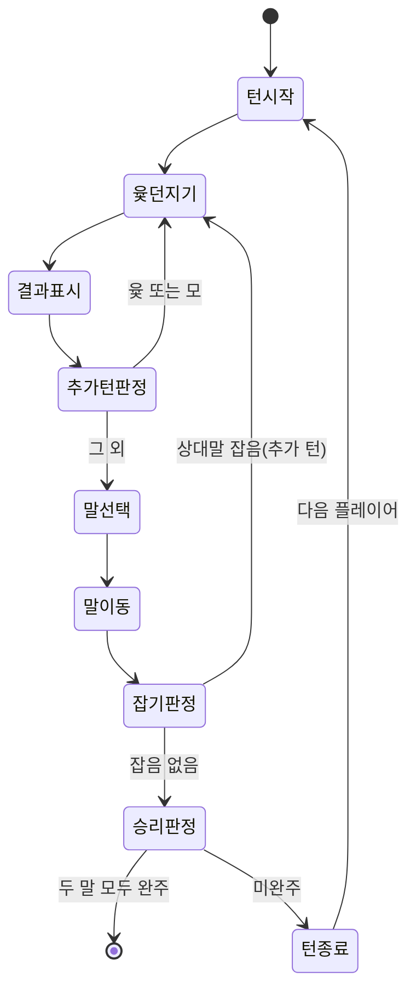
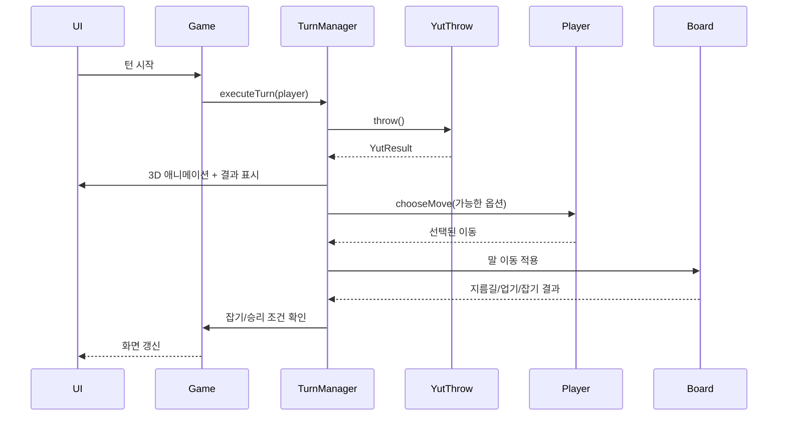

# 별밭 윷놀이 (Starfield Yutnori) PRD

## 0. 문서 정보

| 항목 | 내용 |
|---|---|
| 문서 유형 | PRD (Product Requirements Document) |
| 작성자 | seoulax24 (+ AI 에이전트 co-authoring) |
| 대상 독자 | 본인, 개발을 진행하는 AI 에이전트, 외부 멘토(코드리뷰어) |
| 산출물 | 각 개발 단계별 결과물을 Claude Artifact로 등록 (단일 HTML/JS 파일) |
| 상태 | 9단계 구현 완료 · 10단계(연출·고증·에셋) 진행 중 — 구현과 함께 갱신 |

---

## 1. 개요

### 1.1 프로젝트 소개

AI 에이전트(Claude)와 함께 페어 프로그래밍 방식으로 전통 윷놀이를 웹 게임으로 구현한다. 2~4명의 참가자(사람 또는 봇)가 순서대로 턴을 주고받으며 전통 윷놀이 규칙에 따라 말을 움직여 먼저 두 말을 모두 완주시키는 쪽이 승리한다.

### 1.2 학습 목표

- 사이버 윷놀이 게임을 AI 에이전트와 함께 개발하는 경험을 쌓는다
- 턴 방식 게임(2~4인)의 상태 관리와 흐름 제어를 구현할 수 있다
- 윷놀이 말판 위에서의 말 이동(지름길, 업기, 잡기 포함) 로직을 구현할 수 있다

### 1.3 문서 목적 및 대상 독자

이 문서는 구현에 들어가기 전 기능/규칙/아키텍처에 대한 합의를 기록하고, 이후 여러 개발 세션(대화창)에 걸쳐 단계적으로 작업을 이어갈 때 각 세션이 참고할 단일 기준(source of truth) 역할을 한다. 외부 멘토가 설계 원리를 빠르게 파악할 수 있도록 UML 다이어그램(클래스/상태/시퀀스)을 포함한다.

---

## 2. 용어 정리

| 용어 | 설명 |
|---|---|
| 도/개/걸/윷/모 | 윷 던지기 결과. 각각 1/2/3/4/5칸 전진 |
| 빽도 | 윷 던지기 결과 중 하나. 1칸 후퇴 (시작점 이전이면 즉시 아웃 처리) |
| 업기 | 같은 편의 말 2개가 같은 칸에 있을 때 하나의 묶음으로 합쳐져 함께 이동하는 것 |
| 잡기 | 상대 말이 있는 칸에 도착해 상대 말을 시작 전(말판 밖)으로 되돌리는 것 |
| 지름길 | 말판 모서리(꼭짓점)에서 중앙을 거쳐 반대편으로 질러가는 대각선 경로 |
| 완주 | 말이 말판을 한 바퀴(또는 지름길 경유) 돌아 출발점을 통과해 빠져나가는 것 |
| 턴 | 한 플레이어가 윷을 던지고 말을 움직이는 한 차례의 행동 단위 (추가 턴 포함 가능) |

---

## 3. 기능 요구사항

1. 참가자 2~4명이 순서대로 턴 방식 진행 (인원과 사람/봇 조합은 시작 시 선택)
2. 전통 윷놀이 말판, 각 플레이어 말 2개
3. 턴마다 도/개/걸/윷/모 (+ 빽도) 결과를 표시
4. 말 2개는 업을 수 있으며, 2개 말이 모두 시작점으로 돌아와야 게임 종료
5. 말판/윷 디자인은 보기 좋은 수준에서 자유롭게 결정 (코믹한 톤, 3D 윷 던지기)
6. 그 외 동작은 전통 윷놀이 규칙을 따름 (잡기, 추가 턴 등)

---

## 4. 게임 규칙 상세 명세

### 4.1 말판 구조

전통 윷판을 그래프(노드 + 간선) 구조로 모델링한다. **총 29밭**이며, 고증과 출처는 [docs/yutpan.md](docs/yutpan.md)에 따로 정리했다.

- **외곽 20밭 + 안쪽 십자 8밭 + 방(중앙) 1밭 = 29** = 북극성 1 + 28수
- 형태는 **원형**이다 — 천원지방(바깥 원은 하늘, 안쪽 십자는 땅). 김문표 「사도설」 해석에 따른 원래 모습.
- 자리마다 전통 이름이 있다: 도·개·걸·윷·**모** / 뒷도…**뒷모** / 찌도…**찌모** / 날도…**참먹이**, 십자에는 모도·모개·뒷모도·뒷모개·속모·속윷·안찌·사려
- 4개의 밭(앞밭·뒷밭·쨀밭·날밭)은 각 7밭씩. 29 − 방 − 네 귀 = **24절기** 해석에 따라 사계절 바닥을 입혔다
- 자리 이름의 뿌리인 짐승(도=돼지, 개=개, 걸=양, 윷=소, 모=말)에 맞춰 자리마다 형태를 달리 표현한다 — 도=둥근 돌, 개=나란한 두 돌, 걸=풀 뭉치, 윷=판석, 모=기둥, 방=별, 참먹이=문

**지름길 규칙**: 꼭짓점(모·뒷모·찌모)에 정확히 도달하면 다음 이동에서 지름길을 선택할 수 있다. 지름길은 팔을 따라 **방**에 이르고, **방을 지나면 항상 참먹이 방향(안찌 → 사려 → 참먹이)으로 꺾어 나간다.** 그래서 최단 완주는 `모(5칸) + 지름길(6칸) = 11칸`이다 (외곽만 돌면 20칸).

### 4.2 윷 던지기 확률 (전통 확률 기반)

윷가락 4개, 각각 앞/뒤 50% 가정 시 이항분포를 사용한다.

| 결과 | 조건(앞면 개수) | 확률 | 이동 |
|---|---|---|---|
| 모 | 0개 (전부 뒷면) | 1/16 | +5칸, 추가 턴 |
| 도 | 1개 | 3/16 | +1칸 |
| 빽도 | 1개 (특수 케이스로 분리) | 1/16 | -1칸 |
| 개 | 2개 | 6/16 | +2칸 |
| 걸 | 3개 | 4/16 | +3칸 |
| 윷 | 4개 (전부 앞면) | 1/16 | +4칸, 추가 턴 |

> **설계 결정**: 빽도는 물리적으로 4개 중 1개만 다르게 표시된 특수 윷가락으로 구현하지 않고, "도" 확률(4/16) 중 1/16을 빽도로 분리 배정하는 방식으로 단순화한다. (부록 10.1 참고)

### 4.3 말 이동 규칙

- 말은 출발점에서 시작해 외곽 경로를 따라 반시계 방향(전통 기준)으로 이동한다
- 빽도로 인해 출발점보다 앞(아직 출발 전)으로 이동해야 하면 해당 말은 그대로 대기 상태 유지 (출발 전 상태에서는 빽도 무시)
- 이동 후 도착 칸에 따라 지름길 선택 여부를 플레이어(또는 봇)가 결정
- 말이 정확히 출발점을 통과하여 나가면 "완주" 처리, 더 이상 이동 대상에서 제외

### 4.4 업기 (자동 병합)

- 같은 플레이어의 말 2개가 같은 칸에 도착하면 **자동으로** 하나의 묶음(스택)으로 병합된다
- 병합된 말은 이후 하나의 유닛처럼 함께 이동하며, 윷 던지기 결과만큼 함께 전진/후퇴한다
- 병합된 스택이 상대에게 잡히면 스택 내 말 전체가 동시에 출발 전 상태로 되돌아간다
- 병합된 스택이 완주하면 스택 내 말 전체가 동시에 완주 처리된다

### 4.5 잡기 & 추가 턴

- 이동한 말(또는 스택)이 도착한 칸에 상대 말(또는 스택)이 있으면 상대 말은 즉시 출발 전 상태로 되돌아간다 (잡기)
- 다음 두 조건 중 하나라도 만족하면 같은 플레이어가 윷을 한 번 더 던진다: (a) 윷 또는 모가 나옴 (b) 상대 말을 잡음
- 여러 조건이 동시에 만족되어도 추가 턴은 이벤트 발생 횟수만큼 누적된다 (예: 모가 나오고 동시에 잡기 성공 시 추가 턴 2회)
- 모든 추가 턴을 소진한 뒤에 상대에게 턴이 넘어간다

### 4.6 승리 조건

- 한 플레이어의 말 2개가 모두 완주(출발점을 통과해 빠져나감) 하면 즉시 게임 종료 및 승리 처리

---

## 5. 플레이어 구성 & 봇

### 5.1 시작 플로우

1. 게임 시작 시 두 단계로 묻는다 — "몇 명이 같이 하나요?"(2/3/4) → "그중 사람은 몇 명인가요?"(0 ~ 인원 수)
2. 선택에 따라 나머지는 봇으로 자동 배정
3. 0명(전원 봇) 선택 시: 사람 플레이어의 개입 없이 봇들이 자동으로 턴을 주고받는 관전 모드 화면이 표시됨
4. 인원이 4명 미만이면 남는 캐릭터는 판 옆 휴식처의 그루터기에 앉아 구경한다

### 5.2 봇 AI 동작 방식

당초 "랜덤 유효 선택"으로 계획했으나, 랜덤은 관전 모드에서 납득이 안 되는 수를 두어
**점수 기반 휴리스틱**으로 구현했다 (`planMove`).

| 항목 | 점수 |
|---|---|
| 완주 | 말 1개당 +120 |
| 잡기 | 잡는 상대 말 1개당 +80 |
| 업기(같은 편과 합류) | +18 |
| 진행도 | 도착 자리의 진행도 × 0.8 |
| 새 말 출발 | −4 (다른 선택이 없을 때의 차선) |

즉 **완주 > 잡기 > 업기 > 전진** 순으로 고른다.

**사람은 직접 고른다** (`moveOptions` / `askMove`). 움직일 수 있는 선택지가 둘 이상이면
목록으로 띄우고, 각 항목에 "누가 · 어디 → 어디"와 결과(잡기 / 완주 / 업기 / 지름길)를
적어 보여준다. 같은 점수 함수로 계산한 추천 항목에는 ⭐를 붙이고, 숫자키로도 고를 수 있으며
후보 캐릭터는 발밑 링이 밝아진다. 꼭짓점에 선 말은 **지름길과 일반 경로가 각각 하나의
선택지**로 나오므로 "어느 말을"과 "어느 길로"를 한 번에 정한다 — 별도의 지름길 질문은
봇에게만 남는다(봇은 항상 지름길을 탄다).

- 봇의 턴에는 "🤖 (이름) 생각 중…" 표시를 짧게 띄운 뒤 이동 애니메이션 실행
- 전원 봇 모드에서도 사람이 볼 때와 똑같은 연출(카메라·표정·대사)을 적용해 관전자가
  의사결정과 결과를 따라갈 수 있게 한다

### 5.3 배역과 인격

말은 최대 8개(4인 × 2개)이고 **모두 서로 다른 캐릭터**가 맡는다. 어느 팀인지는 발밑
팀 색상 링과 머리 위 이름표로 구분한다. 캐릭터마다 대기 자세·인사·생각·환호·낙담 포즈,
대사 풀(잡담·결과별 감정·잡기·잡힘·완주·업기·승패), 목소리 피치/속도, 웃음소리가 따로 있다.

| # | 이름 | 성격 | 대기 자세 | 목소리 |
|---|---|---|---|---|
| 1 | 시노 | 차분한 학생회장 | 두 손을 앞으로 모음 | 보통·차분 |
| 2 | 비타 | 씩씩한 모험가 | 두 손을 허리 앞에 | 조금 높고 빠름 |
| 3 | 비비 | 발랄한 아이 | 한 손을 살짝 들고 | 높고 빠름 |
| 4 | 빅토리아 | 우아한 아가씨 | 한 손을 가슴에 | 낮고 느림 |
| 5 | 후미리야 | 느긋하고 능글맞은 소년 | 한 팔을 뒤로, 삐딱하게 | 가장 낮음 |
| 6 | 새별 | 별을 세는 조용한 몽상가 | 두 손을 모으고 고개를 숙임 | 높고 느림 |
| 7 | 노을 | 여유롭고 능청스러운 언니 | 팔짱 | 낮고 여유롭게 |
| 8 | 미르 | 당당한 꼬마 대장 | 허리에 손 | 가장 높고 빠름 |

모델은 5종을 확보했고 6~8번은 앞 모델의 **머리·의상 텍스처 색조만 바꿔** 쓴다 (10.2.1).

---

## 6. 시스템 아키텍처

### 6.1 기술 스택

- 단일 HTML 파일. `game/index.html`에서 개발하고 `docs/index.html`(GitHub Pages)과
  Claude Artifact에 같은 파일을 배포한다
- 렌더링: **말판·캐릭터·윷 던지기 모두 three.js 기반 3D 장면 하나** (5단계에서 2D SVG
  말판을 3D로 교체 — 10.2 참고). 시작 화면도 같은 씬을 쓴다
- 라이브러리: `<script type="importmap">`으로 jsDelivr에서 three 0.180 ESM +
  `@pixiv/three-vrm@3`을 고정 버전으로 로드
- 캐릭터: VRM 모델 5종 + 색조 변경 3종 = 8인 (10.2.1)
- 지형지물: Kenney Nature Kit(CC0) GLB 61개 — 24절기 소품, 귀 석주, 참먹이 문, 휴식처
- 소리: 실제 CC0 녹음(배경음악·윷·발걸음·잡기·완주·팬파레)을 재생하고, 파일을 못
  불러오는 환경에서는 Web Audio API 합성음으로 폴백 (10.3)
- 목소리: 브라우저 음성합성(Web Speech API). 대사를 큐에 넣어 한 번에 하나만 읽는다
- 캐릭터 모델은 필요한 시점에 하나씩 불러온다 — 부팅 시 4명(타이틀 화면 + 2인 게임),
  3·4인을 고르면 그때 부족한 만큼 추가로 불러온다
- 규칙 로직은 `tests/rules.test.mjs`가 단일 HTML에서 스크립트 블록을 뽑아 `node:vm`에서
  검증한다 (GitHub Actions에서 push마다 실행, 배포본 동기화도 함께 확인)
- HUD: 3D 화면 위에 떠 있는 HTML 오버레이 (자리 이름·절기, 캐릭터 이름표, 말풍선,
  결과 이펙트, 현재/다음 턴 패널) — 3D 좌표를 카메라로 투영해 위치를 잡는다
- 턴마다 카메라가 "전체 보기 → 던질 캐릭터 → 윷 확대 → 표정 클로즈업 → 걷기 추적 →
  전체 보기"로 연출되는 시네마틱 흐름
- 상태 관리: 순수 JS 객체 (프레임워크 없이 vanilla JS). 진행 중인 턴은 세대(generation)
  값으로 취소한다

### 6.2 클래스 다이어그램

### 6.3 상태 다이어그램 (턴 흐름)

### 6.4 시퀀스 다이어그램 (한 턴)

---

## 7. UI/UX 디자인 방향

### 7.1 전체 톤앤매너

트리컬(tricky)하고 코믹한 디자인. 진지한 전통 공예품 느낌보다는 장난스럽고 생동감 있는 색감/모션을 사용한다 (말에 표정을 넣거나, 결과에 따라 과장된 리액션 연출 등 자유롭게 판단).

### 7.2 3D 윷 던지기 (three.js)

- 별도 화면이 아니라 **말판과 같은 씬에서 캐릭터가 직접 던진다**. 카메라가 던지기 전에
  그 캐릭터를 보고 있다가, 윷으로 다이브해 클로즈업하고, 결과가 나오면 얼굴로 돌아온다
- 윷가락 4개가 회전하며 떨어지고, 각 가락의 앞/뒤로 결과(도/개/걸/윷/모/빽도)를 판정
- 결과는 격투게임식 이펙트로 화면 가득 띄운다 — 두꺼운 외곽선 글자 + 폭발 링 +
  방사 스피드라인 + 화면 흔들림, "+3칸 이동"이 옆에서 날아 들어와 함께 사라짐

### 7.3 말판 UI

- 3D 원형 윷판. 네 밭에 계절색 바닥(봄 새싹빛·여름 짙은 초록·가을 황금·겨울 회청)을
  깔고, 24자리에는 그 자리의 절기에 맞는 소품을 세운다 ([docs/yutpan.md](docs/yutpan.md))
- 자리마다 이름과 절기를 라벨로 띄우고, 이름의 짐승(도 1·개 2·걸 3·윷 4)은 발판 앞
  조약돌 개수로 표시
- 캐릭터는 자리 표식 옆에 서고 소품은 반대쪽으로 배치해 겹치지 않게 한다
- 업힌 말은 나란히 서서 안쪽 손을 잡고 함께 흔든다 (같은 칸에 서는 건 항상 같은 편)
- 머리 위 이름표(팀 색상 테두리), 말풍선, 감정 이모지가 캐릭터를 따라다닌다
- 왼쪽 상단에 **현재 턴 / 다음 턴**, 남은 추가 턴 수, 그리고 플레이어별 진행 상황
  (말 하나당 막대 + 완주 수)을 표시
- 좁은 화면에서는 HUD를 줄이고 렌즈를 넓혀 판 전체가 들어오게 한다
- 키보드만으로도 플레이할 수 있고(스페이스/엔터로 던지기, 숫자키로 말 선택, y/n으로 지름길),
  결과·차례·승패는 `aria-live` 영역으로 읽어준다. `prefers-reduced-motion`이면 카메라
  연출을 생략한다
- 우클릭 드래그(터치는 한 손가락)로 시점 회전, 휠/핀치로 확대·축소
- 연출 속도 토글(1x / 2x), 소리·목소리 토글

### 7.4 소리와 목소리

- 배경음악·윷 던지기·발걸음·잡기·완주·승리 팬파레는 CC0 녹음을 재생 (docs/audio/README.md)
- 빽도는 잡기 타격음을 0.6배속으로 낮춰 침울한 톤으로 쓴다
- 캐릭터 대사는 브라우저 음성합성으로 읽는다 — 턴 시작 한마디, 결과 낭독, 잡힐 때 비명,
  잡을 때 웃음. 캐릭터별 피치·속도가 다르고, OS에 한국어 음성이 여러 개면 하나씩 배정
- 같은 소리를 반복하지 않는다: 업기 인사와 투닥 효과음은 **만났을 때 한 번만** 나고,
  그 뒤에는 둘이 각자 평소 대사를 주고받는다
- 시작 화면 잡담은 줄 전체에 하나의 시계를 두고 **20초에 한 마디**, 순번대로 돌아간다

---

## 8. 개발 단계별 계획

각 단계는 독립적으로 완료 가능한 단위로 나누며, 완료 시 해당 결과물을 Claude Artifact로 등록한다. 단계 간 전환 시 새 대화창 또는 `/clear` 사용을 권장한다 (이전 단계의 세부 구현 컨텍스트를 매번 재로딩할 필요 없이 이 `plan.md`를 기준으로 이어감).

| # | 단계 | 산출물 | 완료 기준 |
|---|---|---|---|
| 1 | 윷말판 렌더링 | 정적 2D 윷판 (20+ 노드, 지름길 표시) | 노드 좌표가 시각적으로 전통 윷판과 일치, 지름길 경로가 구분되어 보임 |
| 2 | 플레이어/봇 설정 화면 | 인원(2~4) 선택 → 사람 수 선택 → 사람/봇 배정 | 각 조합이 올바르게 배정되고 게임 시작 가능 |
| 3 | 턴 방식 윷 던지기 (로직) | 버튼 클릭 → 확률표 기반 결과 산출/표시 (2D, 3D 이전) | 결과 분포가 4.2 확률표와 근사 일치 (충분한 시행으로 검증) |
| 4 | 3D 윷 던지기 애니메이션 | three.js 기반 3D 윷가락 애니메이션 | 애니메이션 후 3단계 로직과 동일한 결과를 시각적으로 재현 |
| 5 | 말 이동 로직 | 기본 전진/후퇴, 지름길 선택 UI | 지정된 칸 수만큼 정확히 이동, 지름길 선택 시 정확한 경로로 이동 |
| 6 | 업기 로직 | 같은 칸 도착 시 자동 병합 | 병합된 말이 하나의 유닛으로 함께 이동/표시됨 |
| 7 | 잡기 & 추가 턴 | 상대 말 리셋 + 추가 턴 큐 처리 | 잡기 시 상대 말이 정확히 출발 전으로 복귀, 추가 턴 누적 동작 확인 |
| 8 | 봇 AI & 시각화 | 랜덤 유효 선택 전략 + 선택 과정 하이라이트 | 전원 봇 모드에서 관전만으로 게임이 끝까지 자동 진행됨 |
| 9 | 승리 조건 & 통합 테스트 | 전체 게임 통합, 승리 처리 및 재시작 UI | 2개 말 완주 시 즉시 승리 화면 표시, 처음부터 끝까지 버그 없이 1판 플레이 가능 |
| 10 | 연출·고증·에셋 개선 | 29밭 고증, 24절기 지형, VRM 캐릭터 8인, CC0 음원, TTS, 2~4인 플레이 | 요청 단위로 이슈를 만들고 각 이슈가 닫힐 때마다 Pages·Artifact에 배포 ([Milestone 10](https://github.com/progh2/yutnori/milestone/10)) |

---

## 9. 완료 기준 (Definition of Done)

- [x] 위 9단계가 모두 하나의 결과물에 통합되어 동작
- [x] 사람 2명 / 사람 1명+봇 1명 / 봇 2명 조합 모두 정상 플레이 가능
- [x] 3인·4인 게임도 같은 규칙으로 순서대로 진행
- [x] 전통 규칙(지름길, 업기, 잡기, 추가 턴, 빽도)이 모두 반영됨
- [x] 3D 윷 던지기 애니메이션이 정상 동작하며 결과와 일치
- [x] 말판 고증 — 29밭(북극성 + 28수), 천원지방 원형, 사계절·24절기, 자리 이름 ([docs/yutpan.md](docs/yutpan.md))
- [x] 캐릭터 8인이 각자 다른 외형·포즈·대사·목소리를 가짐
- [x] 참가하지 않는 캐릭터는 휴식처에서 앉아 대기
- [x] 소리·목소리는 CC0 음원과 브라우저 음성합성으로 처리하며 라이선스 출처를 문서화
- [x] 사람은 움직일 말과 경로를 직접 고를 수 있고, 판의 진행 상황을 화면에서 읽을 수 있다
- [x] 키보드만으로 플레이 가능하고, 결과·차례가 스크린 리더로 읽히며, 모션 감소 설정을 존중
- [x] 좁은 화면(세로 모바일)에서도 판 전체와 HUD가 겹치지 않고 보인다
- [x] 규칙 로직에 자동 테스트가 있고 push마다 CI에서 실행된다
- [x] 멘토가 이 문서만으로 게임 규칙과 아키텍처를 이해할 수 있음

## 10. 리스크 & 오픈 이슈

- 말판 정확한 노드 좌표/개수는 1단계 구현 시 확정 필요 (현재는 설계 수준 합의)
- three.js 3D 애니메이션과 2D 말판 UI 간 전환 연출 방식은 4단계에서 구체화
- 봇 전략은 1차로 랜덤 선택만 구현, 고도화(휴리스틱 등)는 범위 밖으로 간주 (필요 시 별도 단계 추가 논의)

### 10.1 설계 결정 근거 (부록)

- **빽도 확률 분리**: 실제 윷놀이는 지역/윷가락 형태에 따라 빽도 발생 방식이 다르나, 본 프로젝트는 이항분포 기반 단순 모델에 빽도를 별도 확률로 얹는 방식을 채택 (구현 단순화 목적)
- **추가 턴 누적 방식**: 윷/모와 잡기가 동시에 발생하면 추가 턴을 누적(합산) 처리 — 일부 실제 규칙과 다를 수 있으나 구현/테스트 단순성을 위해 채택
- **봇 시각화**: 전원 봇 모드에서도 학습 목적(턴 방식 진행 시연)을 살리기 위해 각 턴의 의사결정 과정을 사람이 보는 것과 동일하게 노출

### 10.2 말판 3D 전환 (5단계, 아키텍처 변경)

당초 6.1은 말판을 2D SVG로, 윷 던지기만 3D로 두는 것으로 설계했으나, 5단계 진행 중 요청에 따라 **말판/말/시작 화면을 모두 3D로 통일**했다. 턴마다 카메라가 던질 캐릭터 → 윷 확대 → 표정 클로즈업 → 걷기 추적 → 전체 화면으로 이어진다. 어떤 말을 옮길지는 처음에는 자동으로 정했지만, 그것이 윷놀이의 핵심 판단을 없앤다고 보아 10단계에서 **사람이 직접 고르는 UI**를 넣었다 (5.2).

### 10.2.1 캐릭터: VRM 모델 도입 (GitHub Pages 전용)

말(캐릭터)은 **VRoid 프로젝트(pixiv)가 공개한 VRM 공식 샘플 모델**을 사용한다.
배역은 8자리(4인 × 2개)인데 재배포가 허용된 모델은 5종을 확보했고, 남는 3자리는
앞 모델의 **머리·의상 텍스처 색조만 바꿔** 쓴다.

| # | 캐릭터 | 파일 | 처리 |
|---|---|---|---|
| 1 | 千駄ヶ谷篠 (시노) | `docs/models/shino.vrm` | 원본 |
| 2 | ヴィータ (비타) | `docs/models/vita.vrm` | 원본 |
| 3 | ビビ (비비) | `docs/models/vivi.vrm` | 원본 |
| 4 | ヴィクトリア (빅토리아) | `docs/models/victoria.vrm` | 원본 |
| 5 | 桜田史利矢 (후미리야) | `docs/models/fumiriya.vrm` | 원본 |
| 6 | 새별 | shino.vrm | 색조 +155° |
| 7 | 노을 | vita.vrm | 색조 +300° |
| 8 | 미르 | vivi.vrm | 색조 +205° |

모든 파일이 VRM 메타데이터에 `redistribution=allow`, `modification=allow`, 상업이용 허용,
크레딧 불필요를 명시하고 있어 공개 저장소 커밋이 가능하다 (상세: `docs/models/README.md`).
원본 15~20MB를 텍스처만 1024로 재인코딩해 각 6~8MB로 줄였다.

**색조 변경 방식**: MToon 셰이더는 `텍스처 × 색상`이라 재질 색만 바꾸면 짙은 머리는
어두워지기만 한다. 그래서 머리·의상 텍스처를 캔버스에 다시 그리면서 `hue-rotate`를 걸어
새 텍스처로 교체한다. 피부·얼굴·눈 재질과 그 재질이 쓰는 이미지를 공유하는 텍스처는
제외해서 피부색은 건드리지 않는다.

- 포즈: `humanoid.getNormalizedBoneNode()` 로 어깨/팔꿈치/고관절/무릎/척추를 제어. three-vrm의 정규화 rest 포즈가 T-포즈라 오일러 순서 모호함을 피하려고 포즈를 (팔 내림·스윙·팔꿈치·상체·머리) 파라미터로 정의하고 쿼터니언으로 합성한다.
- 표정: VRM 표준 프리셋(`happy`/`sad`/`angry`/`relaxed`/`surprised` + `blink`)을 사용. VRM 0.x의 joy/sorrow/fun은 three-vrm이 자동 매핑한다.
- 로더는 importmap으로 three 0.180 + `@pixiv/three-vrm@3` (jsDelivr)을 불러온다.

**Artifact 폴백**: Artifact는 CSP상 스크립트 외의 리소스를 불러올 수 없어 `.vrm` fetch가 차단된다. 이 경우 자동으로 코드로 제작한 대체 캐릭터(하루·미오)로 폴백하므로, 같은 파일 하나로 Pages에서는 VRM 모델이, Artifact에서는 폴백 캐릭터가 동작한다 — 과제 요구사항인 "결과물 Artifact 등록"도 계속 만족한다.

### 10.3 오디오: CC0 음원 + 합성음 폴백

처음에는 Artifact의 CSP(스크립트 외 리소스 차단) 때문에 외부 오디오 파일을 쓸 수 없다고
보고 Web Audio API로 전부 합성했다. 그러나 합성음이 어색하다는 지적을 받아, **GitHub
Pages에서는 실제 CC0 녹음을 재생하고 Artifact에서는 합성음으로 폴백**하는 이중 구조로
바꿨다.

- 저장소에 담은 음원: 배경음악(동양풍 루프), 윷 던지기(나무 주사위가 나무 판에 구르는
  녹음) 2종, 발걸음, 클릭, 잡기 타격, 완주·추가 턴 벨, 승리 팬파레 — 전부 CC0
  (출처: `docs/audio/README.md`)
- 판정 방식: `canplaythrough` 이벤트로 재생 가능 여부를 확인해, 불러오지 못한 소리만
  합성음으로 대체한다 (Artifact에서는 전부 합성음이 된다)
- 같은 파일 하나로 Pages와 Artifact 양쪽이 동작한다는 원칙은 그대로 유지된다

### 10.4 캐릭터 목소리: 브라우저 음성합성

음원 파일로는 "도·개·걸·윷" 같은 대사를 구할 수 없어 Web Speech API를 쓴다. OS에 설치된
한국어 음성에 의존하므로 음성이 없는 환경에서는 조용히 무음이 된다 (Windows는 보통
한국어 음성이 하나뿐이라 캐릭터별 피치·속도로 구분한다).

구현에서 걸렸던 것들:

- 새 대사마다 `cancel()`을 부르면 엔진이 pause 상태로 남아 이후 대사가 조용히 삼켜진다
  → 대사를 큐에 넣어 하나씩 재생하고, 재생 전 `resume()`을 호출한다
- 시작 직후에는 음성 목록이 비어 있어 한국어 음성을 못 잡는다 → `voiceschanged` 외에
  0.3초 간격으로 최대 6초까지 다시 확인한다
- `speak()`가 아무 이벤트도 내지 않고 끝나는 경우가 있다 → 0.7초 안에 시작되지 않으면
  한 번 다시 시도하고, `onend`가 오지 않는 브라우저를 위해 감시 타이머를 둔다
